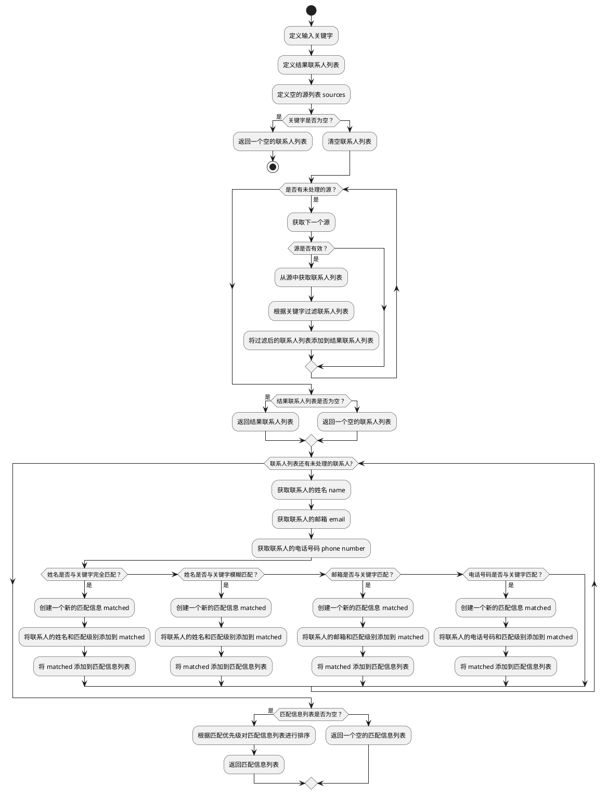

#Search Contacts在Jupiter当中的实现分析

在项目实践中，由于Jupiter接入了多种联系人，联系人模块在搜索的时候需要将各个来源的source的联系人进行搜索并在结果在根据匹配情况返回

```plantuml
@startuml

start

:定义输入关键字;
:定义结果联系人列表;
:定义空的源列表 sources;

if (关键字是否为空？) then (是)
  :返回一个空的联系人列表;
  stop
else
  :清空联系人列表;
endif

while (是否有未处理的源？) is (是)
  :获取下一个源;

  if (源是否有效？) then (是)
    :从源中获取联系人列表;
    :根据关键字过滤联系人列表;
    :将过滤后的联系人列表添加到结果联系人列表;
  endif

endwhile

if (结果联系人列表是否为空？) then (是)
  :返回结果联系人列表;
else
  :返回一个空的联系人列表;
endif


while (联系人列表还有未处理的联系人?)

  :获取联系人的姓名 name;
  :获取联系人的邮箱 email;
  :获取联系人的电话号码 phone number;

  if (姓名是否与关键字完全匹配？) then (是)
    :创建一个新的匹配信息 matched;
    :将联系人的姓名和匹配级别添加到 matched;
    :将 matched 添加到匹配信息列表;
  elseif (姓名是否与关键字模糊匹配？) then (是)
    :创建一个新的匹配信息 matched;
    :将联系人的姓名和匹配级别添加到 matched;
    :将 matched 添加到匹配信息列表;
  elseif (邮箱是否与关键字匹配？) then (是)
    :创建一个新的匹配信息 matched;
    :将联系人的邮箱和匹配级别添加到 matched;
    :将 matched 添加到匹配信息列表;
  elseif (电话号码是否与关键字匹配？) then (是)
    :创建一个新的匹配信息 matched;
    :将联系人的电话号码和匹配级别添加到 matched;
    :将 matched 添加到匹配信息列表;
  endif

endwhile

if (匹配信息列表是否为空？) then (是)
  :根据匹配优先级对匹配信息列表进行排序;
  :返回匹配信息列表;
else
  :返回一个空的匹配信息列表;
endif
```
